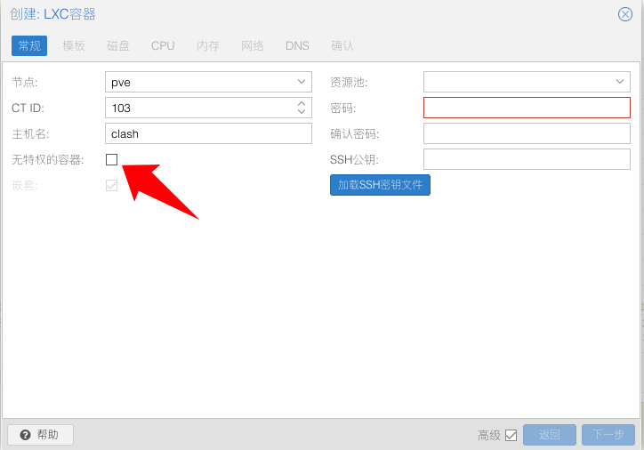

[TOC]

# 项目介绍

> [upstream](https://github.com/wanhebin/clash-for-linux)

## 不同

- start.sh -> dl.sh 只用来下载 -> /etc/clash/clash.yaml
- /temp/template_config.yaml 自己使用的配置

## 目的

配合 [tpclash](https://github.com/mritd/tpclash) 使用

## ProxmoxVE 创建 CT 容器

记得勾选特权 512M/2G 就够了


# 全自动

```sh
mkdir /etc/clash
cd /etc/clash
git clone https://github.com/charlzyx/clash-for-linux.git
# vim .env 编辑这一块 export CLASH_URL='更改为你的clash订阅地址'
./clash-for-linux/dl.sh
# https://github.com/mritd/tpclash/releases 记得找到对应版本
wget https://github.com/mritd/tpclash/releases/download/v0.1.11/tpclash-premium-linux-amd64
mv tpclash-premium-linux-amd64 tpclash
chmod ./tpclash && ./tpclash install
# 开启自启动:
systemctl enable tpclash
#  启动服务
systemctl start tpclash
sleep 3
# 查看日志: 注意看有没有报错
journalctl -fu tpclash

```
